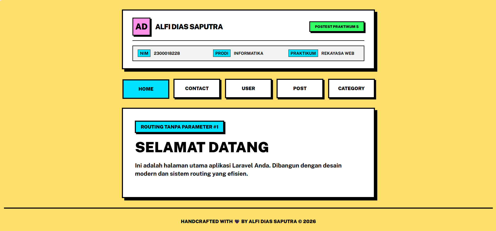
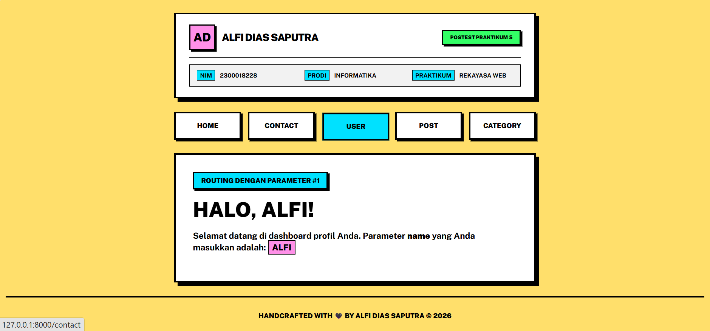
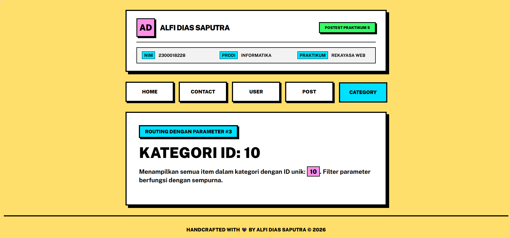

# Praktikum 5 - Rekayasa Web (Laravel Routing)

Tugas Postest Praktikum 5: Implementasi Routing Laravel dengan desain Neobrutalism.

## Identitas Mahasiswa
- **Nama**: ALFI DIAS SAPUTRA
- **NIM**: 2300018228
- **Prodi**: INFORMATIKA
- **Praktikum**: REKAYASA WEB

---

## Deskripsi Tugas
Project ini mengimplementasikan 5 buah routing pada Laravel 11 dengan rincian sebagai berikut:
1. **2 Routing Tanpa Parameter**:
   - `/`: Halaman Utama (Home)
   - `/contact`: Halaman Kontak
2. **3 Routing Dengan Parameter**:
   - `/user/{name}`: Menampilkan profil user berdasarkan nama.
   - `/post/{slug}`: Menampilkan postingan berdasarkan slug.
   - `/category/{id}`: Menampilkan kategori berdasarkan ID unik.

---

## Fitur & Perubahan yang Ditambahkan
### 1. Desain Neobrutalism
Aplikasi ini menggunakan gaya desain **Neobrutalism** yang memiliki karakteristik:
- **Warna Kontras Tinggi**: Penggunaan warna kuning (`#ffdf6b`), pink (`#ff90e8`), dan cyan (`#00e1ff`).
- **Thick Borders**: Border hitam tebal (4px) di hampir semua elemen UI.
- **Hard Shadows**: Bayangan tegas tanpa blur (8px offset) untuk memberikan kesan 3D retro.
- **Typography Bold**: Menggunakan font *Public Sans* dengan weight 900 untuk teks utama.

### 2. Templating Blade
- Menggunakan `layout.blade.php` sebagai template utama (Master Layout).
- Setiap halaman diimplementasikan menggunakan `@extends` dan `@section` untuk efisiensi kode.
- Header dinamis yang menampilkan identitas mahasiswa di setiap halaman.

### 3. Header Branding
Menambahkan bagian header yang mencantumkan detail identitas mahasiswa (Nama, NIM, Prodi, Praktikum) sebagai bukti pengerjaan tugas.

---

## Screenshot Tampilan

### 1. Halaman Utama (Home)

*Halaman utama dengan desain Neobrutalism dan identitas mahasiswa di bagian atas.*

### 2. Halaman User (Parameter: Name)

*Contoh routing dengan parameter nama secara dinamis.*

### 3. Halaman Category (Parameter: ID)

*Contoh routing dengan parameter ID kategori.*

---

## Cara Menjalankan Project
1. Clone repositori ini.
2. Jalankan `composer install`.
3. Salin `.env.example` ke `.env`.
4. Jalankan `php artisan key:generate`.
5. Jalankan `php artisan serve`.
6. Akses di `http://localhost:8000`.
